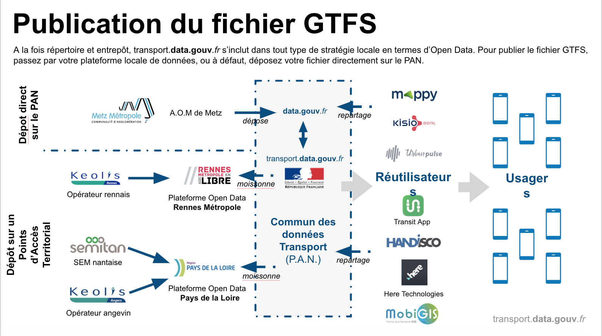

# 10/04/2019 - Tour de France (Rennes)

La rencontre du 10 avril 2018 à l’Hôtel de Rennes Métropole marque la première étape de notre Tour de France des Autorités Organisatrices de Mobilité (AOM). Les rencontres suivant ont eu lieu à Lyon (15 mai 2018), Nancy (31 mai 2018), Toulouse (26 juin 2018), Marseille (10 juillet 2018) et Poitiers (02 octobre 2018). À chaque séance, la démarche [transport.data.gouv.fr](http://transport.data.gouv.fr) a été présentée aux participants, qui ont ensuite été invités à poser toutes leurs questions et à définir ensemble les chantiers d’amélioration du service. 

| 35 participants à cette première rencontre en région dont des représentants de :                                                                                                                                                                                                                                                                             |   |
| ------------------------------------------------------------------------------------------------------------------------------------------------------------------------------------------------------------------------------------------------------------------------------------------------------------------------------------------------------------ | - |
| Rennes Métropole – Keolis Rennes – Brest Métropole – Nantes Métropole – SEMITAN – Lorient Agglomération – Le Mans Agglomération – SETRAM – Région Normandie – Région Bretagne – Région Pays de la Loire – Transdev – Lacroix City – SNCF – Apple Maps – Kisio Digital – Agence d’urbanisme de la région nantaise – DGITM – CEREMA – UTP – Dassault Systèmes. |   |

### **La démarche **[**transport.data.gouv.fr**](http://transport.data.gouv.fr)

[Transport.data.gouv.fr](https://gouv.us13.list-manage.com/track/click?u=5ee8bfe0f1b073b49de06a063\&id=da541c467f\&e=b43908eba7) constitue la démarche conjointe (Ministère des Transport + Etalab + [beta.gouv.fr](http://beta.gouv.fr)) visant à **accélérer l’ouverture des données transport afin d’améliorer l’information voyageur partout en France et de favoriser le développement de services de mobilité au bénéfice des usagers**.

Dans un premier temps, l’objectif est de rendre disponible les données théoriques décrivant les réseaux de transports collectifs (métros, tramways, bus, cars, etc.) produites par l’ensemble des autorités organisatrices de mobilité (AOM) pour permettre à chaque usager d’avoir accès à une information voyageur fiable et complète sur tout le territoire national. À terme, les réutilisateurs pourront accéder aux données décrivant 100% des réseaux de transport français au travers de la plateforme [transport.data.gouv.fr](http://transport.data.gouv.fr).

La démarche [transport.data.gouv.fr](http://transport.data.gouv.fr) vise à constituer le Point d’Accès National français, plateforme unique référençant toutes les données transport pour en faciliter la réutilisation. Elle découle de la directive européenne sur les Systèmes de Transports Intelligents (2010/40/EU) complétée par le règlement délégué (UE) 2017/1926 sur la mise à disposition de services d'informations sur les déplacements multimodaux, lui-même repris en France par le projet de Loi d’Orientation Mobilité 2018.

La plateforme [transport.data.gouv.fr](http://transport.data.gouv.fr) poursuit trois objectifs à ce jour :

* **Référencer** tous les jeux de données théoriques au format GTFS décrivant les réseaux de transports réguliers de personnes en France ;
* **Outiller** les autorités organisatrices et leurs opérateurs pour permettre la mise en qualité de ces données ;
* **Accompagner** les autorités organisatrices dans la mise en conformité de leurs données avec les normes européennes (NeTEx pour les données théoriques, métadonnées,...).

Son architecture est conçue pour s’inscrire dans toute stratégie data territoriale. Ainsi, la plateforme peut agir à la fois comme :

* **Répertoire** : dans le cas où l’autorité organisatrice possède une plateforme de données locale (au niveau de l’agglomération, du département ou de la région), [transport.data.gouv.fr](http://transport.data.gouv.fr) peut « moissonner » la plateforme locale (via [data.gouv.fr](http://data.gouv.fr)) pour référencer les fichiers et les métadonnées sur le Point d’Accès National (ex : cas de Nantes Métropole ou de Rennes Métropole) ;
* **Entrepôt** : dans le cas où l’autorité organisatrice n’a pas la possibilité d’héberger ses jeux de données théoriques sur une plateforme locale, [transport.data.gouv.fr](http://transport.data.gouv.fr) peut les héberger gratuitement (ex : cas de Metz Métropole).

Aujourd’hui, :

* **19 AOM** sont impliquées dans la démarche et référencent/publient (ou se sont engagées à référencer/publier) leurs données transport sur la plateforme nationale des données publiques, [data.gouv.fr](http://data.gouv.fr), qui elle-même alimente [transport.data.gouv.fr](http://transport.data.gouv.fr). Plus d’une quarantaine d’autorités organisatrices ont déjà été contactées par les équipes de [transport.data.gouv.fr](http://transport.data.gouv.fr).
* **6 réutilisateurs pilotes** (Mappy, Kisio Digital, Handisco, Here Technologies, Transit App et Urban Pulse) participent à la démarche.

Les autorités organisatrices ayant publié leurs données sur [transport.data.gouv.fr](http://transport.data.gouv.fr) seront ainsi les premières à voir ces acteurs déployer leurs services de mobilité sur leurs territoires, au bénéfice des citoyens. Ces réutilisateurs contribuent à la mise en qualité des données publiées pour améliorer la fiabilité de l’information voyageur. En effet, la licence choisie sur la plateforme [transport.data.gouv.fr](http://transport.data.gouv.fr) (licence ODbL) impose aux réutilisateurs le partage de toute amélioration/correction des jeux de données téléchargés et le reversement de tout jeu de données modifié/amélioré dans le pot commun.

### **Résumé des discussions**

Les régions présentes (Bretagne, Pays de la Loire, Normandie), bien placées pour animer les politiques open data au niveau territorial, et compétentes en matière de transports interurbains et de transports scolaires depuis la loi NOTRe (2016), se disent a priori favorables à la démarche, mais expliquent en séance les questions qu’elles se posent, en particulier sur la licence de la donnée et la répercussion éventuelle des coûts de production et de mise à disposition.

L’équipe [transport.data.gouv.fr](http://transport.data.gouv.fr) précise que dans le cas des données théoriques en cours de recensement aujourd’hui :

* la question de la licence fait pour l’instant l’objet d’un consensus dans le cadre de la démarche [transport.data.gouv.fr](http://transport.data.gouv.fr) : les autorités organisatrices peuvent ouvrir leur données (1) ou bien en licence ouverte "Etalab", (2) ou bien en licence ODbL « Open Database Licence » dès lors que l’autorité organisatrice donne son accord sur les conditions d’utilisations de la plateforme qui précisent le périmètre de repartage des données demandé aux réutilisateurs.\
   Dans les deux cas, le jeu de donnée sera rendu disponible sur [transport.data.gouv.fr](http://transport.data.gouv.fr) en licence ODbL, avec application des conditions d’utilisation.
* la question du coût ne se pose pas pour les données théoriques : l’État, par le biais d’Etalab, prend en charge tous les coûts d’hébergement sur [data.gouv.fr](http://data.gouv.fr).

La Bretagne, travaillant actuellement sur un projet de plateforme open data, émet des interrogations sur la nécessité de déployer une plateforme territoriale spécifique aux transports. Le Ministère chargé des Transports (DGITM) rappelle que le Point d’Accès National ([transport.data.gouv.fr](http://transport.data.gouv.fr)) peut tout à fait servir de support aux régions pour constituer un point d’accès territorial en marque blanche.

La région Pays de la Loire rappelle de l’information voyageur pour les territoires ruraux, en particulier pour les transports à la demande. De même, la Bretagne met en garde de ne pas se concentrer uniquement sur les données relatives aux transports urbains. Ce sera un des sujets mis à l’ordre du jour de l’atelier réunissant les régions prévu dans les prochains mois par l’équipe [transport.data.gouv.fr](http://transport.data.gouv.fr).

Nantes Métropole engage l’équipe [transport.data.gouv.fr](http://transport.data.gouv.fr) à accélérer sur les discussions avec les services de mobilité grand public, et notamment avec Google Maps, afin que les autorités organisatrices qui rejoignent la démarche puissent bénéficier au plus vite des services de mobilité en question.

Lorient Agglo se propose de partager son expérience sur les questions d’accessibilité des transports publics afin de diffuser les bonnes pratiques dans la publication de jeux de données aux normes.

Keolis Rennes s’interroge sur la pertinence de la norme européenne NeTEx pour l’information voyageur, malgré son intérêt certain pour l’échange entre transporteurs. À court terme, le format GTFS, malgré des défauts notables, reste très adapté pour obtenir des fiches horaires et des itinéraires exploitables par des services de mobilité bénéficiant aux citoyens.

Rennes Métropole précise qu’elle rejoint également la démarche pour l’opportunité qu’elle offre aux autorités organisatrices de récupérer des données d’autres types : données routières, autopartage, covoiturage, etc. L’équipe [transport.data.gouv.fr](http://transport.data.gouv.fr) précise que sur ces sujets, le calendrier reste à définir. Les informations seront transmises via la liste de diffusion.

### **Démonstration de la plateforme**

La plateforme est en démonstration permanente sur [transport.data.gouv.fr](http://transport.data.gouv.fr).

Les autorités organisatrices ou leurs opérateurs peuvent héberger/référencer leurs fichiers au format GTFS sur [data.gouv.fr](http://data.gouv.fr), tandis que le jeu de donnée est ensuite répercuté sur [transport.data.gouv.fr](http://transport.data.gouv.fr) lorsque les conditions sont réunies (publication directement par l’autorité organisatrice ou par son opérateur dans la bonne licence, fichier au format GTFS, technicien en charge du fichier GTFS identifié).

Pour chaque jeu de données disponible sur [transport.data.gouv.fr](http://transport.data.gouv.fr) (13 jeux à ce jour), [transport.data.gouv.fr](http://transport.data.gouv.fr) propose deux modules :

* Un validateur de jeux de données GTFS qui exhibe les erreurs potentielles des fichiers téléchargés ;
* Un module de discussion rattaché à celui de [data.gouv.fr](http://data.gouv.fr) pour permettre la relation directe entre les producteurs et les réutilisateurs afin de favoriser la mise en qualité des jeux de données.

C’est pourquoi l’équipe [transport.data.gouv.fr](http://transport.data.gouv.fr) s’efforce d’identifier pour chaque jeu de données les interlocuteurs (chez l’opérateur ou l’autorité organisatrice) capables de répondre aux éventuelles sollicitations des réutilisateurs et de prendre en compte, le cas échéant, les modifications et les corrections proposées. Les réutilisateurs peuvent également télécharger des jeux de données améliorés sur la page de chaque fiche.

Dans les prochains mois, l’équipe [transport.data.gouv.fr](http://transport.data.gouv.fr) prévoit de collaborer avec l’équipe de l’outil Chouette afin de permettre la conversion des fichiers publiés en format GTFS sur la plateforme nationale en format NeTEx, norme européenne. Cela permettra concrètement à toute autorité organisatrice utilisant [transport.data.gouv.fr](http://transport.data.gouv.fr) de se conformer en un clic à la norme européenne, puis d’enrichir ses données puisque le format NeTEx est beaucoup plus complet.

### **Améliorations techniques proposées par les participants**

La SEMITAN (Nantes Métropole) exprime le souhait de visualiser les différences entre ces jeux de données améliorés et les fichiers initiaux.

Keolis Rennes, partageant son expérience de 8 ans dans l’Open Data, propose plutôt le développement d’outils de visualisation des fichiers GTFS à l’image de ceux utilisés par Google Transit, très simples d’utilisation par des publics non-techniciens, permettant par exemple de vérifier la couleur des lignes décrites dans les jeux de données. Keolis Rennes note également l’opportunité saisie par l’opérateur de générer les fichiers publiés en Open Data à la source afin de garantir la qualité de ces données.

Enfin, plusieurs producteurs (Rennes et Nantes notamment) expriment le manque d’un moyen d’informer les réutilisateurs de la « résolution » d’un problème spécifique sur un jeu de données en particulier.

Il est donc décidé pour les prochaines livraisons de [transport.data.gouv.fr](http://transport.data.gouv.fr) :

* L’amélioration du validateur de données ;
* La possibilité de visualiser des fichiers GTFS pour mieux en déceler les potentielles erreurs pour un public non-expert ;
* Une documentation plus fournie à destination des autorités organisatrices, des opérateurs et des réutilisateurs.

### **Prochaines étapes**

Le Tour de France des Autorités Organisatrices de Mobilité continue :

* Le [15 mai 10h30 – 12h30](https://gouv.us13.list-manage.com/track/click?u=5ee8bfe0f1b073b49de06a063\&id=c2151e2bee\&e=b43908eba7) à Lyon dans les locaux du CEREMA ;
* Le [31 mai 10h30 – 12h30](https://gouv.us13.list-manage.com/track/click?u=5ee8bfe0f1b073b49de06a063\&id=648ec235a0\&e=b43908eba7) à la Métropole du Grand Nancy ;
* Le 26 juin 14h – 16h à Toulouse (lieu à confirmer) ;
* Début juillet à Marseille.

3 ateliers sont en cours d’organisation afin de poursuivre la démarche d’ouverture des données dans les transports.

* Atelier sur le rôle des régions dans l’animation de l’ouverture des données transport sur leur territoire, organisé avec Régions de France ;
* Atelier sur l’intégration des données temps réel dans la démarche nationale ;
* Atelier sur les données de vélos libre-service et l’autopartage dans le cadre des services de transport concédés.

Les parties prenantes qui se sentent concernées par ces ateliers et qui souhaitent y participer peuvent se signaler à [contact@transport.beta.gouv.fr](mailto:contact@transport.beta.gouv.fr).

Les autres données concernées (transport aérien & maritime, données routières et données de voirie, etc.) seront traitées dans un calendrier qui reste à définir.
