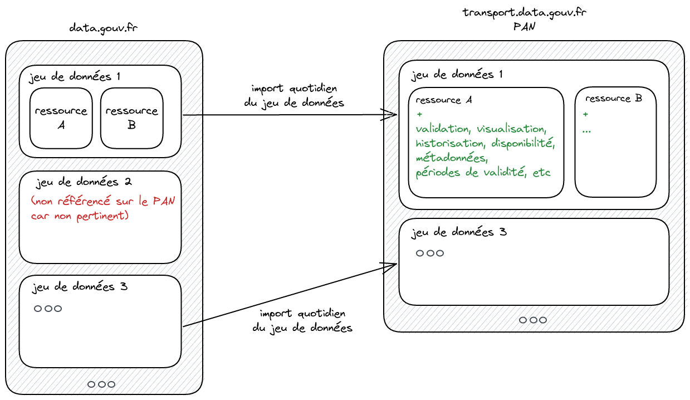

# Liens entre data.gouv.fr et transport.data.gouv.fr

Depuis 2013, l’État a mis en place une plateforme ouverte de données publiques, opérationnelle, pérenne et gratuite : [data.gouv.fr](https://data.gouv.fr). Afin de ne pas faire doublon avec cette plateforme nationale, il a été décidé de s’appuyer sur celle-ci pour constituer le Point d’Accès National français.

Ainsi, transport.data.gouv.fr est une extension thématique de data.gouv.fr où seules les données de transport respectant des formats et/ou schémas spécifiques sont référencées afin d’assurer une harmonisation des données et d’en faciliter la réutilisation**.** Par exemple, si des données sur le stationnement cyclable sont publiées sur data.gouv.fr mais qu’elles ne sont pas conformes au [schéma national pour le stationnement cyclable](https://schema.data.gouv.fr/etalab/schema-stationnement-cyclable/), elles ne seront pas référencées sur transport.data.gouv.fr.

<figure><figcaption></figcaption></figure>

De plus, le Point d’accès national propose différents outils permettant d’évaluer la qualité des données, d’améliorer leur découvrabilité et de les valoriser comme :

* les validateurs pour les données au format [GTFS ](https://transport.data.gouv.fr/validation)ou [GBFS](https://transport.data.gouv.fr/tools/gbfs/analyze)
* l’outil de [suivi de disponibilité des ressources](https://transport.data.gouv.fr/resources/51449)
* l’[outil de visualisation des GBFS\
  ](https://transport.data.gouv.fr/datasets/trottinettes-dieppe/)etc.&#x20;

La [publication des jeux de données est gérée via data.gouv.fr](liens-entre-data.gouv.fr-et-transport.data.gouv.fr.md#quel-est-le-lien-entre-transport.data.gouv.fr-et-data.gouv.fr) qui agit, selon le choix du producteur, en tant qu’entrepôt ou que répertoire de données :

* **Entrepôt** : le producteur de données peut héberger son jeu de données sur data.gouv.fr de manière gratuite ;
* **Répertoire** : le producteur de données peut héberger son jeu de données sur une plateforme open data locale, que data.gouv.fr pourra ensuite [_moissonner_](https://doc.data.gouv.fr/jeux-de-donnees/demander-a-datagouvfr-de-moisonner-votre-site/), c’est-à-dire référencer de manière automatique.

Les mises à jour peuvent quant à elles être faites à partir de data.gouv.fr ou de transport.data.gouv.fr. Plus d’informations ici : [https://doc.transport.data.gouv.fr/producteurs/mettre-a-jour-des-donnees](https://doc.transport.data.gouv.fr/producteurs/mettre-a-jour-des-donnees)
