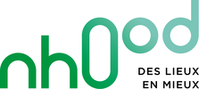

# Les réutilisateurs

### [1km à pied](https://www.1kmapied.com/)

### \*\*\*\*[**Andyamo**](http://www.andyamo.fr/)\*\*\*\*

### \*\*\*\*[**Apitux**](http://www.apitux.com/)\*\*\*\*

### [Avem](https://www.avem.fr/)

### \*\*\*\*[**BlaBlaCar**](https://www.blablalines.com/)\*\*\*\*

### \*\*\*\*[**Citymapper**](https://citymapper.com/company)\*\*\*\*

### \*\*\*\*[**Cityway**](https://www.cityway.fr/)\*\*\*\*

### \*\*\*\*[**ComparaBus**](https://www.comparabus.com/)\*\*\*\*

### \*\*\*\*[**Google Maps**](https://maps.google.fr/)

### \*\*\*\*[**GoSense**](http://www.gosense.com/)\*\*\*\*

### \*\*\*\*[**Handisco**](https://handisco.com/)\*\*\*\*

### \*\*\*\*[**Here Technologies**](https://www.here.com/)

### \*\*\*\*[**Karos**](https://www.karos.fr/)\*\*\*\*

### \*\*\*\*[**Kisio Digital**](https://kisio.com/metiers/solutions-digitales/)\*\*\*\*

### [Kombo](https://www.kombo.co/)

### [Le Localisateur](https://localisateur.org/)

### \*\*\*\*[**Les Voitures**](https://lesvoitures.fr/)

### \*\*\*\*[**Lumiplan**](https://www.lumiplan.com/)\*\*\*\*

### \*\*\*\*[**Mappy**](https://fr.mappy.com/)\*\*\*\*

### \*\*\*\*[**Metis**](https://www.metis-reseaux.fr/)\*\*\*\*

### \*\*\*\*[**MyBus**](https://www.mybus.io/)

### \*\*\*\*[**Nhood**](https://nhood.fr/fr)\*\*\*\*

### \*\*\*\*[**Rome2rio**](https://www.rome2rio.com/)

### \*\*\*\*[**Taxi Jaunes**](https://taxisjaunes.fr/)

### \*\*\*\*[**theTreep**](https://www.thetreep.com/)\*\*\*\*

### \*\*\*\*[**tictactrip**](https://www.tictactrip.eu/)\*\*\*\*

### \*\*\*\*[**Transit**](https://transitapp.com/)\*\*\*\*

### \*\*\*\*[**Transitec**](https://transitec.net/fr/)\*\*\*\*

### \*\*\*\*[**Urban Pulse**](https://urbanpulse.fr/)

### \*\*\*\*[**ViaTransit**](https://viatransit.fr/)\*\*\*\*

### \*\*\*\*[**Vivanoda**](https://viatransit.fr/)\*\*\*\*

