# Documentation sur les aménagements cyclables

Dans le cadre des travaux de l’équipe du Point d’accès national et de la mise en œuvre de l’ouverture des données pour améliorer l’information dont disposent les voyageurs, l’équipe de transport.data.gouv.fr, en collaboration avec l'association [Vélo & Territoires](https://www.velo-territoires.org), propose une solution simple et structurée pour l’ouverture des données sur les aménagements cyclables : la Base Nationale des Aménagements Cyclables (BNAC). Elle s’adresse à toute collectivité qui souhaite se lancer dans l’ouverture d’une base décrivant ses aménagements cyclables.

Le schéma de la base de données a été co-construit avec&#x20;

* Géovélo : producteur et réutilisateur de données
* Des collectivités productrices de données :
  * Les villes d'Angers, de Brest, de Grenoble, de Montpellier, de Paris
  * Le syndicat intercommunautaire Ouest Cornouaille Aménagement (SIOCA)
  * Les communautés de communes Touraine Vallée de l'Indre et Val d'Ille-Aubigné &#x20;
  * Les communautés d'agglomération Grand Chambéry, Pays Basque et Ventoux Comtat Venaissin&#x20;
  * La communauté urbaine Grand Poitiers
  * Les métropoles Grand Lyon et Nantes métropole
  * Les départements du Finistère et d'Ille-et-Vilaine
  * Les régions Bretagne, Île-de-France et Hauts-de-France
* Des associations et instituts : Allons à Vélo Allons à Pied (AVAP), Citoyens de Seignanx, Club des villes et territoires cyclables (CVTC), Droit au Vélo (ADAV) , Fédération des usagers de la bicyclette (FUB), Institut Paris Région, MobilityData, OpenStreetMap (OSM),&#x20;
* Des réutilisateurs : Mon Univert, Systra

Cinq ateliers ouverts (le[ 27/06/2019](https://doc.transport.data.gouv.fr/documentation/liste-des-rencontres-publiques/27-06-2019-infrastructures-cyclables), le 14/04/2020, le 8/06/2020, le [8/07/2020 ](https://doc.transport.data.gouv.fr/documentation/liste-des-rencontres-publiques/08-07-2020-infrastructures-cyclables-2)et le[ 27/08/2020](https://doc.transport.data.gouv.fr/documentation/liste-des-rencontres-publiques/27-08-2020-infrastructures-cyclables-3)) ont permis sa production. Il a notamment été établi après une enquête et plusieurs réunions du groupe de travail.

## Description des différents types d'aménagements et régimes de priorités&#x20;

Vous trouverez ci-dessous la définition de tous les aménagements cyclables autorisés dans les champs "ame\_d", "ame\_g"  et de certains régimes de priorités présents dans les champs "regime\_v\_d" et "regime\_v\_g" du schéma de données qui a été élaboré afin d'harmoniser les données sur les aménagements cyclables.&#x20;

Ces aménagements ne sont pas tous réglementaires et ont pour objectif de décrire la réalité du terrain sans être exhaustifs. Les définitions sont accompagnées de photos :&#x20;

* d'aménagements conformes à la définition ;
* d'aménagements non conformes à la définition ;
* des signalétiques associées à l'aménagement.

Certains aménagements, dont les aménagements non réglementaires, ne contiennent pas toutes ces illustrations.

Ces aménagements ont été définis grâce aux définitions et illustrations :&#x20;

* du Centre d'études et d'expertise sur les risques, l'environnement, la mobilité et l'aménagement ([CEREMA](https://www.cerema.fr/fr)) ;
* du [Wiki d'OpenStreetMap sur les aménagements cyclable](https://wiki.openstreetmap.org/wiki/FR:Bicycle) ;
* de la Fédération Française des Usagers de la Bicyclette ([FUB](https://www.fub.fr)) ;
* de l'Association Droit au Vélo ([ADAV](https://droitauvelo.org)) ;
* de l'association [Vélo & Territoires ](https://www.velo-territoires.org);
* de[ France Vélo Tourisme](https://www.francevelotourisme.com/conseils/preparer-mon-voyage-a-velo/reseau-cyclable-france),&#x20;
* d'Emmanuel Roche, Grand Chambéry
* de Michael Häusle, [SIOCA](https://www.sioca.fr)


Noms des aménagements cyclables \
Les notions entre parenthèse et en italique représentent l'équivalent du nom de l'aménagement dans OpenStreetMap&#x20;


## Aménagements cyclables

### Accotement revêtu&#x20;

La désignation « accotement revêtu », que les gestionnaires de la route appellent aussi « bande multifonctionnelle », désigne une surlargeur revêtue, adjacente à la chaussée. Elle a une fonction sécuritaire. Elle permet l'arrêt d'un véhicule en panne, la récupération d’un véhicule déviant de sa trajectoire normale en autorisant des manœuvres d’urgences et facilite les intervention d'urgence.&#x20;

Elle permet également aux cyclistes de circuler en sécurité.&#x20;

Un accotement revêtu d'une largeur suffisante offre un confort et une sécurité comparable aux bandes cyclables. Seuls les cyclistes ont le droit de rouler dessus en marche normale, au contraire des autres véhicules qui eux doivent rester sur la partie centrale de la chaussée. Le statut d’accotement permet en effet arrêt et stationnement des véhicules motorisés \[6, R. 417-1], sauf décision contraire de l'autorité investie du pouvoir de police matérialisée par la signalisation prévue à cette effet, ce que ne permettent pas les bandes cyclables et pistes cyclables. si la voie centrale ne permet pas à deux véhicules de se croiser, alors il faut classer l'aménagement en chaussée centrale à voie banalisée.&#x20;


**Aménagement conforme**

****.png>)****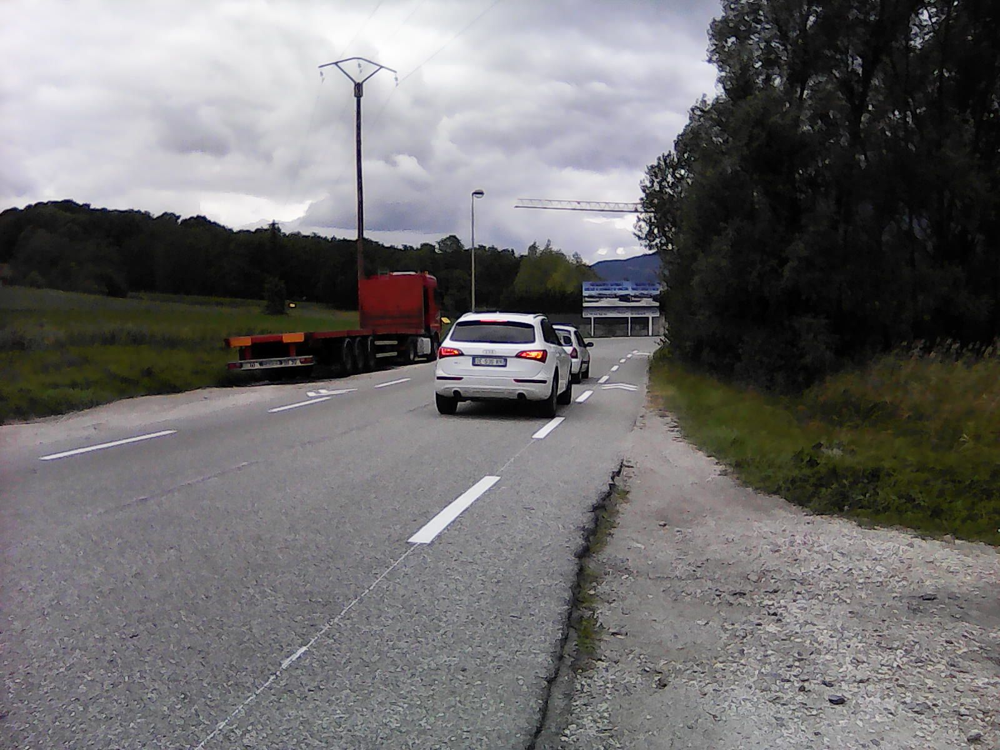 ****&#x20;


### Aménagements mixtes piéton/vélo hors voie verte&#x20;

Les définitions suivantes ne caractérisent pas des aménagements règlementaires mais décrivent ce que l'on peut rencontrer sur le terrain. Ponctuellement, en ville, en cas de rétrécissement de l’emprise (ouvrage d’art, point dur, émergence, etc.), une cohabitation piétons-cyclistes peut être envisagée sur une courte distance. Franchissement supérieur : sur les ponts, les emprises sont souvent limitées et obligent cette cohabitation sur un même espace. &#x20;

**Franchissement supérieur** : sur les ponts, les emprises sont souvent limitées et obligent cette cohabitation sur un même espace. Piétons et cyclistes circulent généralement tous dans le même sens ce qui favorise la mixité et limite les risques de conflits du fait de trajectoires différentes.

**Franchissements inférieurs** : de la même manière, la mixité peut être autorisée sur une courte distance.

**Rétrécissement ponctuel** : cela oblige parfois à interrompre l’aménagement cyclable et une zone de mixité est alors préférable au renvoi du cycliste sur la chaussée.

**Carrefour** : maintenir les pistes cyclables dans les carrefours importants est généralement complexe notamment du fait des nombreux croisements avec les flux piétons.

### Bande cyclable&#x20;

Une bande cyclable désigne une voie exclusivement réservée aux cycles à deux ou trois roues sur une chaussée à plusieurs voies (Décret n° 98-828 du 14 septembre 1998, art. R110-2 ).&#x20;

Elle est unidirectionnelle. Il n'y a pas de séparation physique avec la chaussée mais un simple marquage au sol, à savoir une ligne blanche discontinue T3 5u ou exceptionnellement par une ligne continue 3u. Dans le cas général, une bande cyclable facultative est signalée par un marquage de type T3 5u et une figurine « vélo » accompagnée d'une flèche. La figurine et la flèche sont facultatives. Le panneau C113 pourra être utilisé en cas de mauvaise perception de la bande, notamment dans les intersections avec le réseau structurant, en cas de discontinuité ou en début de l’aménagement. L’obligation d'emprunter une bande, à réserver à des configurations particulières, peut être instaurée par l’autorité investie du pouvoir de police après avis du préfet (art. R.431-9). Elle est exprimée sur le terrain par l’utilisation du panneau B22a. La circulation des autres véhicules, le stationnement et la livraison y sont interdits.

_Dans OpenStreetMap, la bande cyclable est généralement décrite au moyen des tags suivant :_ [_cycleway_](https://wiki.openstreetmap.org/wiki/FR:Key:cycleway)_=_[_lane_](https://wiki.openstreetmap.org/wiki/FR:Key:cycleway)


**Aménagement conforme**&#x20;

.png>) .jpeg>)&#x20;



**Signalétiques associées à cet aménagement**

**A l'entrée :**&#x20;

Panneau C113 (usage conseillé)          -          &#x20;

&#x20;     .png>)        &#x20;

&#x20;Panneau B22a (usage obligatoire)

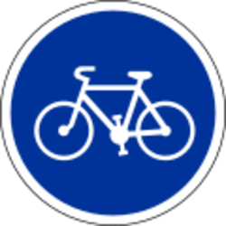&#x20;

&#x20;                                &#x20;

&#x20;  &#x20;

**En sortie :**

&#x20;**** Panneau C114 (usage conseillé)           -   &#x20;

&#x20;     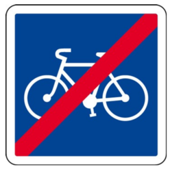  &#x20;

Panneau B40 (usage obligatoire)

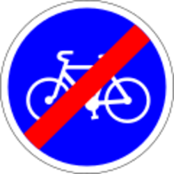&#x20;


### Chaussée à voie centrale banalisée&#x20;

La chaussée à voie centrale banalisée, ou « C.V.C.B. », est un aménagement particulier d’une chaussée lorsqu’il est impossible, pour des questions de largeur disponible, d’y tracer des bandes cyclables. On crée alors une voie centrale de circulation générale, banalisée car elle accueille la circulation dans les deux sens. La largeur restante est octroyée à des accotements revêtus où peuvent circuler piétons et cyclistes et permettent aux véhicules motorisés de se croiser en empiétant sur ces espaces. Cet aménagement n’a pas vocation à être d’emploi systématique mais doit rester exceptionnel. Le statut d’accotement permet en effet arrêt et stationnement des véhicules motorisés \[6, R. 417-1], sauf décision contraire de l'autorité investie du pouvoir de police matérialisée par la signalisation prévue à cette effet, ce que ne permettent pas les bandes cyclables et pistes cyclables. La largeur minimale recommandée des accotements d’une chaussée à voie centrale banalisée est la même que celle des bandes cyclables, 1,50 m hors marquage.

_Dans OpenStreetMap, la chaussée à voie centrale banalisée est généralement décrite au moyen des tags suivant :  (_[_highway_](https://wiki.openstreetmap.org/wiki/FR:Key:highway)_=\*_[_\[1\]_](https://wiki.openstreetmap.org/wiki/FR:Bicycle#cite\_note-anyroad-1) _+_ [_cycleway_](https://wiki.openstreetmap.org/wiki/FR:Key:cycleway)_=lane +_ [_lanes_](https://wiki.openstreetmap.org/wiki/FR:Key:lanes)_=1 +_ [_oneway_](https://wiki.openstreetmap.org/wiki/FR:Key:oneway)_=no)_


**Aménagement conforme**

****.png>)&#x20;



**Aménagement non conforme**

.png>) &#x20;

Une chaussée à voie centrale banalisée est équipée d’accotements. À ce titre, les figurines vélo ne doivent pas y être tracées



**Signalétique associée à cet aménagement**

Il n’y a pas, à l’heure actuelle, de panneau officiel indiquant l’entrée d’une chaussée à voie centrale banalisée, cependant on constate l’émergence de certains signaux à l’initiative des gestionnaires locaux

.png>)


### Couloir ouvert bus/vélo&#x20;

Un couloir bus-vélos est une voie dédiée à la circulation mixte des bus et des vélos (article R412-7 du code de la route).&#x20;

Le couloir de bus dit « fermé » : La séparation est un séparateur non franchissable ou une ligne continue. La largeur recommandée est de 4,50 m avec un minimum de 4,30 m. Les bus et les cyclistes peuvent se doubler à l'intérieur du couloir. Le couloir de bus dit « ouvert » : La séparation du couloir dit ouvert se fait par une ligne discontinue. Dans ce type de couloir, le bus et le cycliste peuvent sortir du couloir pour se doubler. Largeur de 3 m à 3,50 m.

_Dans OpenStreetMap, le couloir ouvert bus/vélo est généralement décrit au moyen des tags suivant :_  [_cycleway_](https://wiki.openstreetmap.org/wiki/FR:Key:cycleway)_=_[_share\_busway_](https://wiki.openstreetmap.org/wiki/FR:Tag:cycleway%3Dshare\_busway)__


**Aménagement conforme**&#x20;

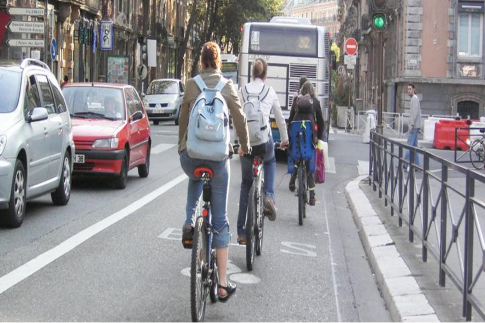&#x20;



**Signalétiques associées à l'aménagement**&#x20;

**Au sol**  : Marquage discontinu T3 5u, alternance marquage « bus » + flèche + logo vélo

.png>)

**Panneau** : Panonceau vélo apposé sous un panneau B27

&#x20; .png>)


### Double sens cyclable&#x20;

Le double-sens cyclable, ou « D.S.C. », n’est pas tant un objet qu’un concept ou une caractéristique portée par une rue. Une rue dite « en double-sens cyclable » est à double sens de circulation — ou bidirectionnelle —, mais un de ces sens est réservé aux seuls cyclistes.&#x20;

On prêtera attention à sa dénomination et, bien que l’expression contre-sens cyclable ait pu être régulièrement utilisée, on évitera désormais son emploi afin d’éviter toute confusion avec la circulation à contre-sens qui est une infraction. La fermeture d’un sens de circulation aux véhicules motorisés est rendue possible par l’article L. 2213-2 du Code général des collectivités territoriales. Les rues dont la vitesse maximale autorisée est de 30 km/h ou moins ont toutes vocation à être en double-sens cyclable, sauf décision contraire motivée de l’autorité investie du pouvoir de police. La création de l’article R. 412-28-1 étend son domaine d’emploi initialement cantonné aux zones de rencontre et zones 30. La mise à double-sens cyclable d’une rue peut se faire par un grand nombre de moyens, du plus simple au plus technique, du plus léger au plus lourd. En ce sens, le « D.S.C. » ne saurait désigner un seul et unique aménagement. Le sens réservé aux seuls cyclistes pourra donc être, selon le cas :

* non matérialisé;
* matérialisé par des pictogrammes (figurine vélo accompagnée d’une flèche directionnelle);
* séparé par une ligne axiale, continue (largeur 2u) ou discontinue (type T’1-2u ou T3-2u);
* matérialisé par une bande cyclable (ligne séparatrice est du type « bande » T3-5u avec une surlargeur de 50 cm);
* matérialisé par une piste cyclable.

Étant donné qu’en France, la circulation se fait à droite (6, R. 412-9), la voie réservée aux cycles longera toujours le bord droit de la chaussée vue par ses usagers et, réciproquement, longera le bord gauche de la chaussée du point de vue des usagers de véhicules motorisés.&#x20;

La présence du panonceau M 9v2 est obligatoire même lorsque le double-sens cyclable est une règle par défaut, puisque c’est ce panonceau et lui seul qui modifie la prescription signalée par le panneau de sens interdit B1."

_Dans OpenStreetMap, le double sens cyclable est généralement décrit au moyen des tags suivant :_ [_oneway_](https://wiki.openstreetmap.org/wiki/FR:Key:oneway)_=no_


**Aménagements conformes**

.png>) .png>)&#x20;



**Aménagement non conforme**

.png>)&#x20;

Aménagement confus : une bande cyclable est indiquée comme obligatoire. Deux panneaux C 24c la signalent comme bidirectionnelle alors qu’un panneau C 12 précise que la rue est à sens unique. La largeur de la bande est manifestement incompatible avec le croisement de cyclistes. Enfin, le débouché de la voie réservée est obstrué par un îlot qui contraint les cyclistes à se déporter face aux véhicules motorisés à l’approche.



**Signalétique associée à cet aménagement**&#x20;

**Au sol :** Ligne continue 3u sur 10m**,** flèche associée pictogramme vélo

.png>)

**Panneau** : Panneau C24c

&#x20;.png>)&#x20;

Panneau : Panneau B1 accompagné d'un panneau M9V2

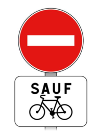&#x20;


### Goulotte

Aménagement qui facilite la montée et la descente d’un escalier avec un vélo à la main en le faisant rouler dans une goulotte ou sur une rampe située à droite ou à gauche de l’escalier.


**Aménagement conforme**

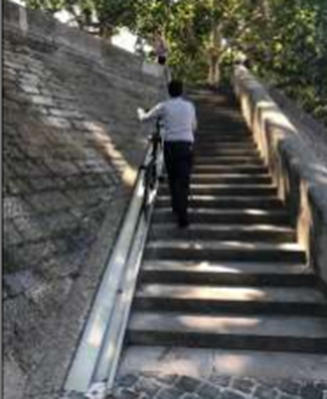&#x20;


### Piste cyclable&#x20;

Chaussée exclusivement réservée aux cycles à deux ou trois roues et aux engins de déplacement personnel motorisés (Article R. 110-2 du code de la route).&#x20;

Les piétons ne peuvent pas y circuler, sauf en l'absence d'espaces dédiés aux piétons. Les pistes cyclables peuvent être unidirectionnelles, à un seul sens de circulation, ou bidirectionnelles, à deux sens de circulation.&#x20;

Les largeurs recommandées d’une piste cyclable sont de 2 m pour une piste unidirectionnelle et de 3 m pour une piste bidirectionnelle. Ces largeurs doivent être adaptées au contexte local et à la fréquentation. L'utilisation des pistes cyclables est conseillée aux cyclistes, sauf décision contraire de l’autorité investie du pouvoir de police pour rendre l'aménagement cyclable obligatoire (avis du préfet à demander).&#x20;

Les pistes cyclables sont signalées par du marquage au sol et/ou par des panneaux. Le choix du panneau dépend du caractère obligatoire de la piste. Lorsqu’elle est obligatoire, on utilise le signal B 22a. Lorsqu’elle est seulement conseillée, on a recours au panneau C 113. Ce dernier est d’emploi facultatif en présence du marquage au sol au début de l'aménagement. Lorsque les cyclomotoristes sont autorisés à utiliser ces voies, par un arrêté pris par l'autorité investie du pouvoir de police, on ajoute le panonceau M 4d2 sous le panneau utilisé. Des panneaux équivalents comme le B40 ou le C114, barrés de rouge, signalent la fin d’un aménagement. Les marques au sol qui désignent les voies réservées aux cycles sont du type « figurine » (au début de l'aménagement et en rappel), ou « figurine encadrée » (réservé au début de l'aménagement)."

_Dans OpenStreetMap, la piste cyclable est généralement décrite au moyen des tags suivant :_  [_cycleway_](https://wiki.openstreetmap.org/wiki/FR:Key:cycleway)_=_[_track_](https://wiki.openstreetmap.org/wiki/FR:Tag:leisure%3Dtrack)__


&#x20; **Aménagement conforme**&#x20;

&#x20;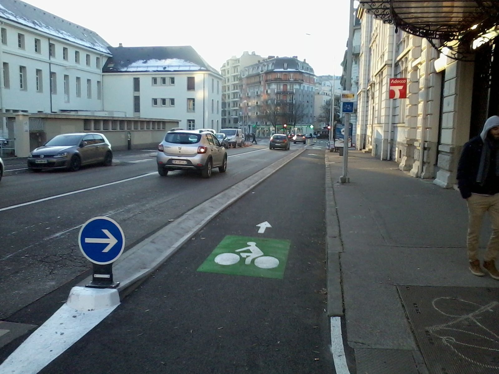 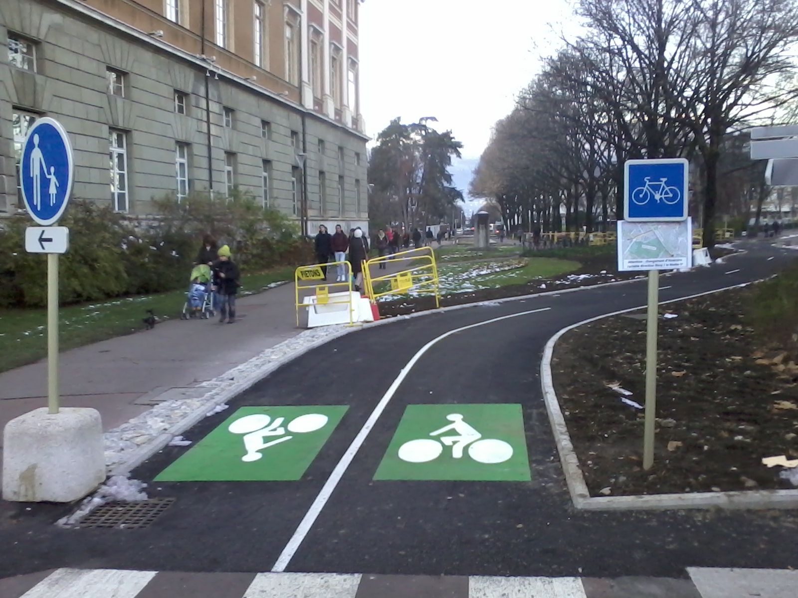&#x20;



**Aménagement non conforme**&#x20;




**Signalétique associée à cet aménagement**

**A l'entrée :**

Panneau C113 (usage conseillé)          -          &#x20;

&#x20;     .png>)   &#x20;

&#x20;  &#x20;

Panneau B22a (usage obligatoire)

&#x20;  &#x20;

**En sortie :**

&#x20;**** Panneau C114 (usage conseillé)           -   &#x20;

&#x20;       &#x20;

Panneau B40 (usage obligatoire)



### Vélorue&#x20;

La vélorue n’a, à l’heure de l’écriture de ce document, pas de cadre réglementaire en France. Elle existe ailleurs en Europe : en Belgique, au Danemark ou aux Pays-Bas. Plusieurs collectivités françaises dont Strasbourg, Bordeaux, Dijon ont tout de même franchi le cap et ont transformé certaines de leurs rues en vélorues.

&#x20;On retrouve certains traits communs à ces voies, comme la notion de priorité du cycliste, la recherche de réduction des vitesses, et le découragement du transit. Dans certains cas, il est même interdit de dépasser les cyclistes.

_Dans OpenStreetMap, la vélorue est généralement décrite au moyen des tags suivant :_  [_cyclestreet_](https://wiki.openstreetmap.org/wiki/FR:Key:cyclestreet)_=yes_


**Aménagement suggéré**

.png>)&#x20;



**Signalétiques associées à cet aménagement**

La vélorue n’étant pas encore réglementée , aucune signalisation particulière n’y est associée. On constate cependant que les collectivités qui utilisent la vélorue ont recours au marquage au sol de trajectoires matérialisées pour cycles. Elles l’accompagnent d’un panneau représentant un cycliste devant une automobile, modèle semblable à celui déjà utilisé en Belgique.&#x20;

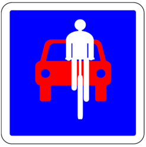


### Voie verte&#x20;

Une voie verte désigne une route exclusivement réservée à la circulation d'usagers non motorisés, à savoir les piétons au sens large (pratiquants de rollers, personnes en fauteuil roulant…), les cyclistes et les cavaliers. Ce sont des aménagements en site propre (séparés de la circulation motorisée), destinés aux déplacements quotidiens et de loisirs, et souvent réalisés sur une ancienne voie de chemin de fer désaffectée, un chemin de halage, un chemin rural, un chemin forestier, etc. (Décret n° 2004-998 du 16 septembre 2004). Sa Largeur varie entre 3 et 5m. Elle est signalée à l'entrée par un panneau C115 et en sortie par un panneau C116.

L'autorisation à cheval nécessite l'installation du panonceau M4y sous le panneau voie verte (C115).

_Dans OpenStreetMap, la voie verte est généralement décrite au moyen des tags suivant :_  [_highway_](https://wiki.openstreetmap.org/wiki/FR:Key:highway)_=_[_path_](https://wiki.openstreetmap.org/wiki/FR:Tag:highway%3Dpath)__


**Aménagement conforme**&#x20;

****



**Aménagement non conforme**

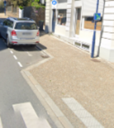

Malgré la tentation de mélanger vélos et piétons sur un trottoir, ce dernier ne peut pas être qualifié comme une voie verte. En effet, une voie verte est un axe en site propre.



**Signalétiques associées à cet aménagement**

**A l'entrée :** Panneau C115&#x20;

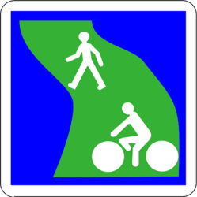&#x20;

**En sortie :** Panneau C116&#x20;

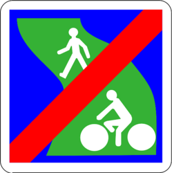&#x20;


## Régimes de priorités

### Aire piétonne&#x20;

Les cyclistes y sont la plupart du temps admis (c'est leur interdiction qui doit être signalée), mais ils doivent y circuler au pas et sans gêner les piétons

Une aire piétonne désigne une section ou un ensemble de sections de voies en agglomération, hors routes à grande circulation, constituant une zone affectée à la circulation des piétons de façon temporaire ou permanente. Dans cette zone, sous réserve des dispositions de l’article R431-9 du code la route, seuls les véhicules nécessaires à la desserte interne de la zone sont autorisés à circuler à l’allure du pas et les piétons sont prioritaires sur ceux-ci. Les entrées et sorties de cette zone sont annoncées par une signalisation.&#x20;

Les rues d'une aire piétonne ont toutes vocation à être en double-sens cyclable, sauf décision contraire motivée de l’autorité investie du pouvoir de police.


**Aménagement conforme**

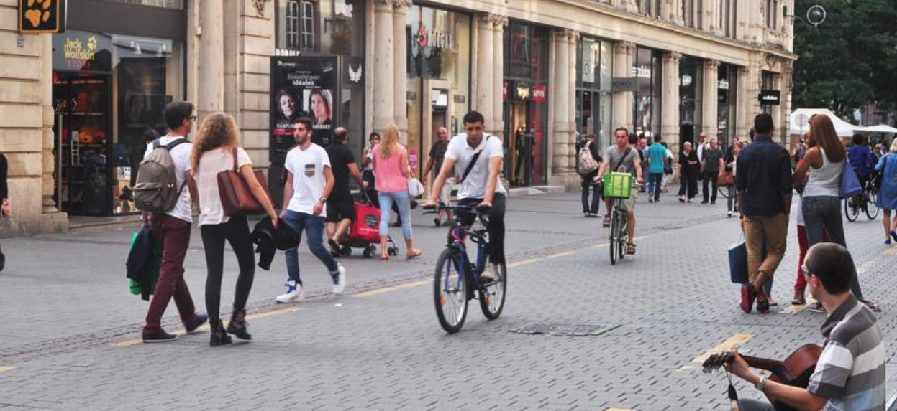&#x20;



**Signalétique associé à l'aménagement**&#x20;

**A l'entrée  :** Panneau B54

.png>)&#x20;

**En sortie :** Panneau Panneau B55&#x20;

.png>)


### Zone de rencontre&#x20;

Une zone de rencontre désigne une section ou un ensemble de sections de voies en agglomération constituant une zone affectée à la circulation de tous les usagers. Dans cette zone, les piétons sont autorisés à circuler sur la chaussée sans y stationner et bénéficient de la priorité sur les véhicules. La vitesse des véhicules y est limitée à 20 km/h.  Les entrées et sorties de cette zone sont annoncées par une signalisation et l’ensemble de la zone est aménagé de façon cohérente avec la limitation de vitesse applicable.&#x20;

Les rues d'une zone de rencontre ont toutes vocation à être en double-sens cyclable, sauf décision contraire motivée de l’autorité investie du pouvoir de police.&#x20;

_Dans OpenStreetMap, la zone de rencontre est généralement décrite au moyen des tags suivant :_  [_highway_](https://wiki.openstreetmap.org/wiki/FR:Key:highway)_=_[_living\_street_ ](https://wiki.openstreetmap.org/wiki/FR:Tag:highway%3Dliving\_street)__


**Signalétique associée à l'aménagement**

**A l'entrée** : Panneau B52 :

.png>)&#x20;

**En sortie :** Panneau B53&#x20;

.png>)&#x20;


### Zone 30 [_(maxspeed_](https://wiki.openstreetmap.org/wiki/FR:Key:maxspeed)_=30)_

Une zone 30 désigne une section ou un ensemble de sections de voies constituant une zone affectée à la circulation de tous les usagers. Dans cette zone, la vitesse des véhicules est limitée à 30 km/h. Les entrées et sorties de cette zone sont annoncées par une signalisation B30 et B51, et l’ensemble de la zone est aménagé de façon cohérente avec la limitation de vitesse applicable.&#x20;

Les rues dont la vitesse maximale autorisée est de 30 km/h ou moins ont toutes vocation à être en double-sens cyclable, sauf décision contraire motivée de l’autorité investie du pouvoir de police.&#x20;

_Dans OpenStreetMap, la zone 30 est généralement décrite au moyen des tags suivant :_  [_maxspeed_](https://wiki.openstreetmap.org/wiki/FR:Key:maxspeed)_=_[_3_](https://wiki.openstreetmap.org/wiki/FR:Tag:highway%3Dliving\_street)_0_


**Signalétique associée à l'aménagement**&#x20;

**A l'entrée :** Panneau B30 :

&#x20;.png>)

**En sortie :** Panneau B51&#x20;

&#x20;.png>)


Si vous avez des questions, n'hésitez pas à nous contacter à l'adresse suivante :  [contact@transport.beta.gouv.fr](mailto:contact@transport.beta.gouv.fr)

## Définition des types de revêtement&#x20;

Vous trouverez ci-dessous la définition des valeurs autorisées dans  dans les champs "revetement\_d", "revetement\_g"  du schéma national des aménagements cyclables. \
Ces valeurs, et leurs définitions, sont issues du géostandard Covadis "Véloroutes et voies vertes" de [Vélo & territoires](https://www.velo-territoires.org). Elles ont été ajoutées au schéma à la suite du vote de la [Pull request #33](https://github.com/etalab/schema-amenagements-cyclables/pull/33).&#x20;

### Lisse

Revêtement de type béton bitumineux, béton de ciment, enrobé écologique, asphalte qui convient au plus grand nombre d’usagers (tout type de vélo, roller).

### Rugueux&#x20;

Revêtement de qualité intermédiaire allant du sol bien stabilisé à un enduit praticable avec un vélo tout chemin.

### Meuble

Revêtement de qualité moyenne à médiocre moyennement stabilisé ou meuble ne convenant qu’aux vélos tout terrain et marcheurs.

