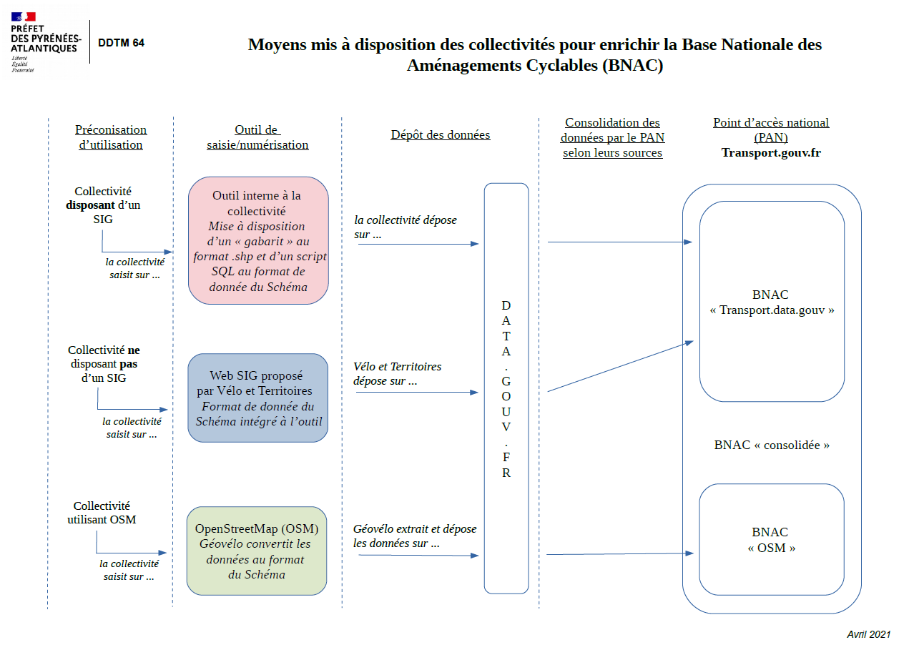

# Procédures de publication, consolidation et mise à jour

### Procédures de publication 

Les jeux de données seront publiées au format GeoJSON. Certains champs sont obligatoires et d'autres optionnels. Les champs obligatoires doivent être complétés. Les champs optionnels peuvent être vides si la donnée n’est pas disponible. La colonne doit toutefois être présente.

Les producteurs pourront saisir leurs données sur : 

* des outils internes ; 
* l'outil développé par Vélo & Territoires ;
* OpenStreetMap (OSM) ; 

Géovélo a également mis en place une conversion des données sur les aménagements cyclables vers le s[chéma national ](https://schema.data.gouv.fr/etalab/schema-amenagements-cyclables/latest.html)pour leurs clients. 

Pour la publication des données, les producteurs pourront :

* publier directement sur [data.gouv.fr ](https://www.data.gouv.fr/fr/)

Pour publier sur [data.gouv.fr](https://www.data.gouv.fr/fr/), vous aurez à créer un [compte personnel](https://doc.data.gouv.fr/gestion-du-compte/creer-un-compte/) puis un [compte pour votre organisation](https://doc.data.gouv.fr/organisations/creer-une-organisation/). Vous pourrez ensuite publier des jeux de données à travers votre compte organisation. 

* déléguer la publication des données à Vélo & Territoires si les données ont été saisie sur leur outil\

* déléguer la publication des données à Géovélo

Vous trouverez un schéma résumant les différents modes de production et de publication ici édité par la Direction Départementale des Territoires et de la Mer (DDTM) des Pyrénées-Atlantiques : 

Nous préconisons aux producteurs de données de publier leurs fichiers avec la règle de nommage suivante : amenagementcyclable_nom.geojson avec nom étant le nom de la collectivité productrice des données, par exemple AménagementCyclable_Ain.geojson

Nous encourageons également les producteurs à spécifier que le fichier déposé repose sur le schéma d'aménagements cyclables dans la section "schéma" (liste déroulante) et que le fichier est au format GeoJSON dans la section "format" lorsqu'ils publieront leurs données à partir de leur espace administrateur [data.gouv.fr](https://www.data.gouv.fr/fr/). 

.png>)

### Consolidation 

Deux bases seront publiées sur transport.data.gouv.fr : 

* une base nationale regroupant les données publiées par les collectivités sur [data.gouv.fr](https://www.data.gouv.fr/fr/) ;
* une base rassemblant les données publiées sur OSM. Vélo & Territoires sera en charge de l'extraction de ces données. 

### Mise à jour

La consolidation de la base sera effectuée en continu par [transport.data.gouv.fr](https://transport.data.gouv.fr) à partir des fichiers publiés sur [data.gouv ](https://www.data.gouv.fr/fr/)avec le tag “aménagements cyclables” par les producteurs et Vélo & Territoires.  des fichiers importés depuis OpenStreetMap ou directement transmis par mail. De nouvelles versions seront publiées lorsque de nouveaux aménagements cyclables seront recensés ou mis-à-jour par les producteurs de données. Cette mise à jour se fait à partir du fichier communiqué précédemment et en reprenant, en les modifiant le cas échéant, les données existantes. Le fichier principal du dataset constitue ainsi systématiquement la dernière mise-à-jour.

Nous tenons à remercier les membres du groupe de travail pour leur investissement dans l'élaboration de ce schéma.
