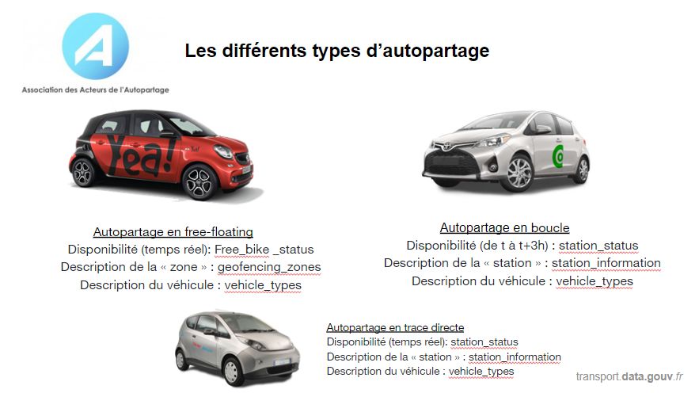

# Autopartage

Dans le cadre des travaux de l’équipe du Point d’accès national et de la mise en œuvre de l’ouverture des données pour améliorer l’information dont disposent les voyageurs, l’équipe de [transport.data.gouv.fr](https://transport.data.gouv.fr), en collaboration avec Nicolas Frasie ([Communauto](https://paris.communauto.com)), [MobilityData](https://mobilitydata.org) et l'[Association des Acteurs de l'Autopartage](https://www.asso-autopartage.fr), propose une solution simple et structurée pour l’ouverture des données sur l'offre d'autopartage. Cette solution repose sur une évolution du format [GBFS](https://github.com/NABSA/gbfs) (General Bikeshare Feed Specification) permettant d'inclure les caractéristiques de l'offre d'autopartage par :

* l'intégration de nouveaux champs comme `rider_capacity, cargo_volume_capacity, cargo_volume_load, eco_label, vehicle_accessories, g_CO2_km, vehicle_equipment, parking_hoop, available_until` etc.&#x20;
* la modification des valeurs autorisées de champs existants comme `parking_type, parking_hoop` etc.
* La modification de la description de certains champs comme `is_virtual_station` etc.

Cette évolution a mené à la [version 2.3 GBFS](https://github.com/NABSA/gbfs/blob/v2.3/gbfs.md).&#x20;

\
Elle s’adresse à tout opérateur de mobilité partagé dont l'autopartage en free floating, en boucle ou en trace directe, qui souhaite se lancer dans l’ouverture de ses données-réel.

Cette évolution du GBFS a été co-construite avec :&#x20;

* l'[Association des Acteurs de l'Autopartage](https://www.asso-autopartage.fr) dont Nicolas Frasie ([Communauto](https://paris.communauto.com)), Gilles Kister ([Citiz](https://citiz.coop)), Badr Hadji ([ShareNow](https://www.share-now.com/fr/fr/paris-ppc1/?cid=sn\_ppc\_fr\_par\_none\_performance\_google\_brand-tcepsorp\_none\_none\_none\_none\_none\_none\_none\_none\&gclid=Cj0KCQiA\_JWOBhDRARIsANymNOZ0-yAQe17Xs1teSZpYvhpyrlTcLAv\_eVdtS6hfzCg3o6Qrqh-JM\_UaAlBeEALw\_wcB)), Stéphane Boutonnet (Movinblue), Pierre Trouvé ([matters.tech](https://matters.tech)), Lucas Machin ([getaround](https://fr.getaround.com))
* [Iodines](https://iodines.fr) avec Loic Urbain&#x20;
* [MobilityData](https://mobilitydata.org)
* des collectivités comme la ville de Paris, le département de la Correze &#x20;
* des réutilisateurs comme [Transit](https://transitapp.com/?lang=fr), [Citymapper](https://citymapper.com), [Kisio Digital](https://kisio.com), [Île-de-France Mobilités](https://www.iledefrance-mobilites.fr)

Le choix s'est porté sur le GBFS car c'est le standard ouvert pour les offres de mobilités partagées qui est déjà utilisé pour l'ouverture des données oour les vélos, trotinettes, scooters en libre-service. \
Les données, rafraîchies à une fréquence définie par le producteur, permettent notamment de connaître :&#x20;

* &#x20;La localisation des stations, lorsqu’il y en a&#x20;
* &#x20;L’état des stations (pleines ou vides), lorsqu’il y en a&#x20;
* Le niveau de disponibilité des véhicules&#x20;
* &#x20;La tarification&#x20;
* &#x20;La description des véhicules

Ce format a été développé par des opérateurs publics et privés, des développeurs d’applications et des fournisseurs de solutions technologiques. Son évolution est fédérée par MobilityData.&#x20;

Nous avons priviliégie ce format au [MDS](https://github.com/openmobilityfoundation/mobility-data-specification) (Mobility Data Specification) car le MDS est plus destiné à la gestion des flottes par les collectivités qu'à l'ouverture des données. Vous trouverez une comparaison entre le GBFS et le MDS ici : \

 (1).png>)

Trois ateliers ouverts (le12/11/2020, le , le 8/06/2020, le 23/02/2021 et le28/05/2021), plusieurs ateliers avec les acteurs d'autopartage, MobilityData et les retours de la communauté de la [NABSA (North American Bikeshare et Scootershare Association)](https://nabsa.net) sur [notre proposition d'évolution du GBFS](https://github.com/NABSA/gbfs/pull/350) ont permis sa production.&#x20;
