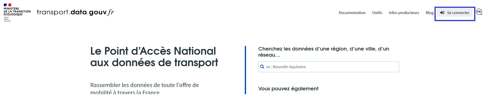

# 1. Méthode transport.data.gouv.fr


Nous présentons ici la méthode pour publier un jeu de données depuis transport.data.gouv.fr qui propose un parcours simplifié pour la publication de données sur le thème de la mobilité. La même opération pourrait être réalisée sur data.gouv.fr.\
\
Vous devez être associé à un "compte Organisation" data.gouv.fr pour publier des données. \
Si ce n'est pas le cas, vous trouverez les étapes à suivre [ici](https://doc.transport.data.gouv.fr/producteurs/comment-et-pourquoi-les-producteurs-de-donnees-utilisent-ils-le-pan).


* Se connecter sur transport.data.gouv.fr (à partir de son compte data.gouv.fr) : [https://transport.data.gouv.fr/login/explanation?redirect\_path=%2F](https://transport.data.gouv.fr/login/explanation?redirect\_path=%2F)

* Accéder à votre espace producteur à cette adresse : [https://transport.data.gouv.fr/espace\_producteur](https://transport.data.gouv.fr/espace\_producteur)
* Cliquer sur "Publier un jeu de données"

.png>)

* Choisir _"publier en tant qu'organisation"_ et en sélectionnant l'organisation pertinente
* Un **formulaire** vous permet de décrire votre jeu de données :
  * **Titre :** nous vous recommandons d'indiquer dans le titre le contenu du jeu de données et la couverture géographique des données et le format des données si cela est pertinent. Voici quelques exemples :
    * Horaires théoriques du réseau Astuce - Métropole de Rouen (GTFS)
    * Aménagements cyclables - Grand Poitiers
    * Parkings hors voirie - Ville d'Annecy
  * **Description :** préciser le contenu des données, leur rythme de mise à jour, leur mode de production...
  * **Licence :** choisir Licence ouverte/Open Licence version 2.0 ou Open Data Commons Open Database License (ODbL)
  * **Fréquence de mise à jour :** préciser si vous connaissez le rythme de mise à jour
  * **Mots clefs :** il est généralement utile de préciser le format des données dans les tags. Comme gtfs ou irve... Certains tags sont attendus si les données correspondent à un schéma hébergé sur _schema.data.gouv.fr_
* Un **second formulaire** vous permet d'ajouter des ressources au jeu de données. Pour importer votre premier fichier, cliquez sur le bouton _Choisissez un fichier_ de votre ordinateur. Une fois votre fichier importé, vous pouvez le décrire en complétant le formulaire qui apparaît alors sur votre écran. Si votre jeu de données contient plusieurs fichiers, **remplissez un formulaire par fichier.** Il est également possible de référencer un fichier de données distant en utilisant une URL plutôt que de déposer un fichier.&#x20;

Vous pouvez alors publier le jeu de données. Nous serons alerté de sa publication et nous nous chargerons de son référencement sur _**transport.data.gouv.fr.**_&#x20;


Une fois ces formulaires remplis vous pourrez décider de publier _"publiquement"_ les données ou de manière _"privée"_ (c'est-à-dire non visible par des utilisateurs non administrateurs de la plateforme). Si vous choisissez _"privé"_ pour une raison, merci de nous signaler la publication (à l'adresse _contact@transport.beta.gouv.fr_) car notre système d'alerte ne nous permet pas de détecter les jeux de données publiés de manière privée (quand bien même ils sont ensuite rendus publics).

