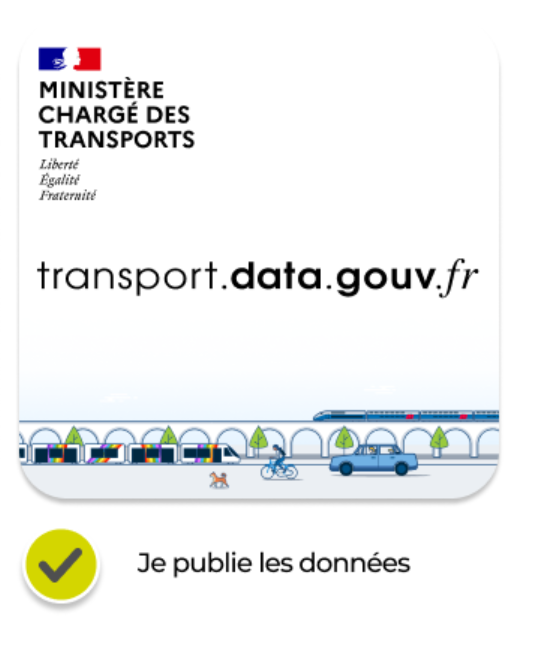

# Export depuis l'espace client des fournisseurs

Les fournisseurs de solutions de comptage propose l’export vers le schéma national de comptage des mobilités.&#x20;

## Eco-compteur&#x20;

\
Les collectivités clientes peuvent importer ou exporter les données selon ce nouveau standard national. Les jeux de données peuvent être ensuite publiés sur le Point d'Accès National.\
Voici les étapes à suivre : &#x20;

1. Se connecter sur[ Ecovisio](https://www.eco-visio.net/v5/login/?callback=%2Fv5%2F#::)\

<figure><figcaption></figcaption></figure>

2. Exporter les données

<figure><figcaption></figcaption></figure>

3. Publier les données sur transport.data.gouv.fr

<figure><figcaption></figcaption></figure>

## TagMaster

\
Les collectivités clientes peuvent insérer leur relevé de comptage depuis EasyAnalisis puis les télécharger sous le format comptage des mobilités pour [les publier sur transport.data.gouv.fr](https://doc.transport.data.gouv.fr/producteurs/comment-et-pourquoi-les-producteurs-de-donnees-utilisent-ils-le-pan/publier-un-jeu-de-donnees/1.-methode-transport.data.gouv.fr).\
Voici les étapes à suivre :

1. Se rendre sur [https://ea.tagmaster.com](https://ea.tagmaster.com/)
2.  Sélectionner le format de données "Comptage Mobilité":\
    \

    <figure><figcaption></figcaption></figure>
3.  Déposer un fichier issu d'un équipement de comptage TagMaster dans l'encart prévu à cet effet:\
    \

    <figure><figcaption></figcaption></figure>
4.  Renseigner les informations sur le site et le compteur, qui sont pré-remplies à partir des méta-données du fichier d'enquête :\
    \

    <figure><figcaption></figcaption></figure>
5.  Sélectionner les dates de début et de fin à utiliser, la période d'aggrégation et les directions des voies, puis cliquer sur démarrer pour déclencher la génération\
    \

    <figure><figcaption></figcaption></figure>
6.  Le fichier est téléchargé sous forme de zip, avec les 3 fichiers CSV dedans:\

    <figure><figcaption></figcaption></figure>

Si vous avez des questions, n'hésitez pas à contacter : Guillaume Pamart, Responsable Support Technique, à l’adresse guillaume.pamart@tagmaster.com
