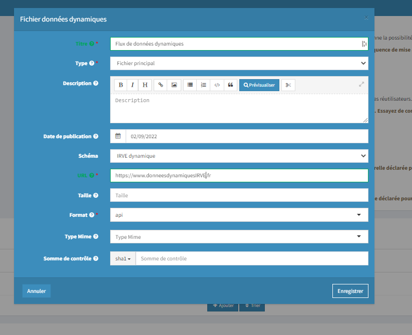

# Publier des données dynamiques

La publication des données dynamiques se fait depuis l'espace administration de data.gouv.fr au niveau du jeu de données déjà existant contenant les données statiques.

En effet, il est important d'avoir **un jeu de données complet composé des données statiques et des données dynamiques** afin que les réutilisateurs puissent facilement faire le lien via la clé commune "id\_pdc\_itinerance".&#x20;

Il faut donc vous rendre sur le jeu de données existant et y **ajouter une ressource** en précisant bien au niveau du schéma **"IRVE dynamique" :**  &#x20;

<figure><figcaption>
Ajout d'une ressource depuis data.gouv.fr
</figcaption></figure>

****

Les données dynamiques ayant pour objectif de remonter l'information en temps réel, **nous vous recommandons de les déposer sur un lien distant hébergé chez vous**. Ainsi, vous n'aurez qu'à référencer l'url https à partir de laquelle les réutilisateurs pourront venir télécharger les données.&#x20;

L'objectif in fine étant d'apporter une information fiable auprès des conducteurs de véhicules électriques, nous suggérons vivement aux producteurs de **ne pas dépasser un temps de rafraichissement de la donnée supérieur à 1 minute**.  &#x20;

