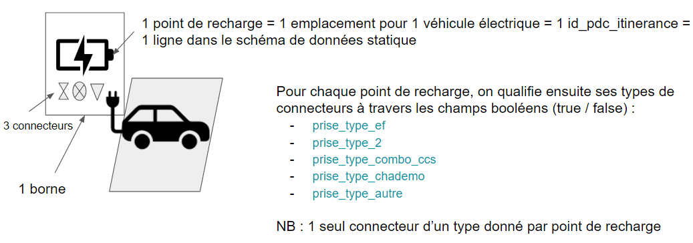
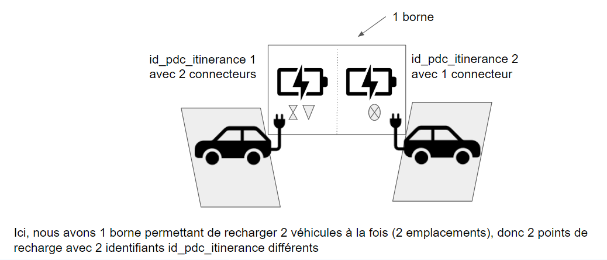
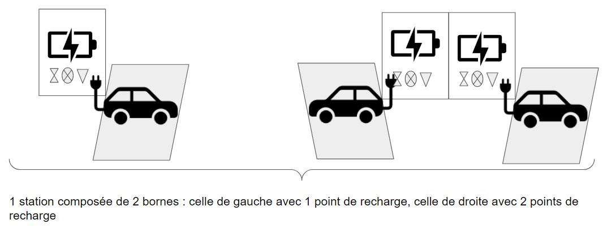
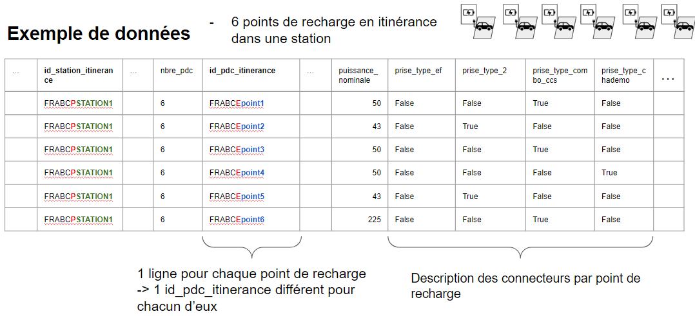

# Exemple de données statiques

**Quelques illustrations de la définition d'un point de recharge et de la transcription dans le schéma de données statiques** &#x20;


**Rappel : 1 ligne du fichier de données = 1 point de recharge = 1 id\_pdc\_itinerance**


<figure><figcaption></figcaption></figure>

<figure><figcaption></figcaption></figure>

<figure><figcaption></figcaption></figure>

<figure><figcaption></figcaption></figure>
