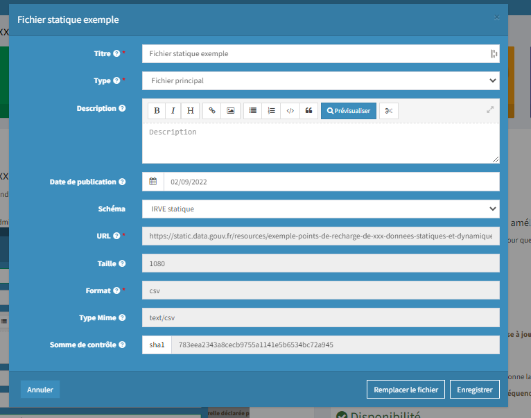

# Publier ses données sur data.gouv.fr

**Prérequis** : Pour mener à bien cette étape, il vous faudra préalablement créer un compte sur data.gouv.fr et vous affilier à une organisation si ce n'est pas déjà le cas (voir sections ci-après).

### **Création d'un compte**

Si vous n'en avez pas déjà un, créez un compte à votre nom sur [data.gouv.fr](https://www.data.gouv.fr).

📖 Référence : [https://doc.data.gouv.fr/gestion-du-compte/creer-un-compte/](https://doc.data.gouv.fr/gestion-du-compte/creer-un-compte/).

### **Création ou choix d'une organisation**

Si elle n'existe pas déjà, créez une organisation depuis votre compte. Cette organisation peut représenter votre collectivité ou votre société.

📖 Référence : [https://doc.data.gouv.fr/organisations/creer-une-organisation/](https://doc.data.gouv.fr/organisations/creer-une-organisation/)

Si l'organisation sous laquelle vous souhaitez publier existe déjà, vous pouvez la rejoindre

📖 Référence : [https://doc.data.gouv.fr/organisations/demander-a-rejoindre-une-organisation/](https://doc.data.gouv.fr/organisations/demander-a-rejoindre-une-organisation/).Chargement des données sur data.gouv.fr

### Publication des données via data.gouv.fr

Une fois vos données prêtes, vous pouvez les charger sur data.gouv.fr directement **depuis votre espace administration en créant un jeu données et en y ajoutant la ressource statique.**

Pour cela, n'oubliez pas de rattacher votre ressource au schéma "IRVE statique" et d'ajouter un mot-clé "IRVE" à votre jeu de données. Cela facilitera le travail de consolidation.&#x20;

<figure><figcaption>
Ajout de la ressource statique
</figcaption></figure>

### Publier via l'outil [publier.etalab.studio](https://publier.etalab.studio/select?schema=etalab%2Fschema-irve)

Vous pouvez également passer par l'interface de l'outil [publier.etalab.studio](https://publier.etalab.studio/select?schema=etalab%2Fschema-irve) qui se chargera de la publication de votre nouveau jeu de données. Il vous faudra remplir un formulaire.

.png>)

### ****

##
