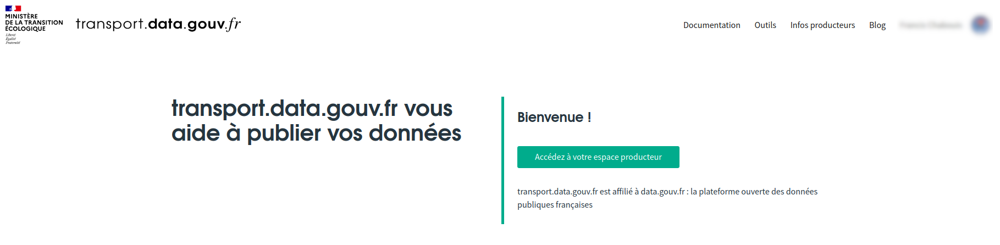
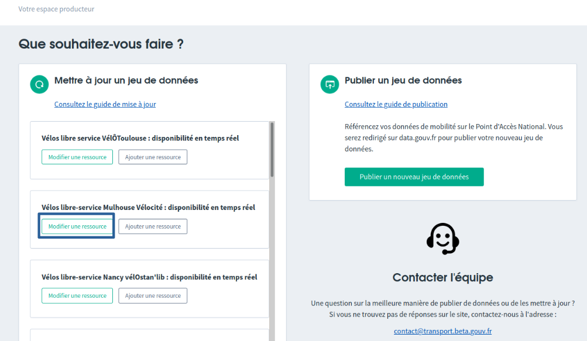

# Mettre à jour des données

Les données périmées ont un impact direct sur les usagers des transports. C'est une personne qui attend un bus qui ne passera pas par exemple. Pour cette raison, il est indispensable que vos données publiées soient toujours à jour.

### Remplacer un jeu de données existant plutôt qu'en créer un nouveau

Un jeu de données se compose d'une ou plusieurs ressources (sous la forme de fichiers, par exemple le fichier GTFS .zip, ou les fichiers .json du GBFS sont des ressources).


Pour mettre à jour des données, il est important de ne pas créer un nouveau jeu de données, mais plutôt de remplacer les ressources concernées à l'intérieur du jeu de données.


### Procédure pas à pas pour mettre à jour

1. Allez sur [https://transport.data.gouv.fr/infos\_producteurs](https://transport.data.gouv.fr/infos\_producteurs). Regardez en haut à droite de la page : si vous n'êtes pas déjà identifié.e, faites-le en cliquant sur _S'identifier_.
2. Cliquez sur "Accédez à votre espace producteur"
3. Dans l'encart "Mettre à jour un jeu de données", trouvez parmi la liste de vos jeux de données celui que vous souhaitez mettre à jour.
4. Sous ce jeu de données, cliquez sur "Modifier une ressource"
5. Choisissez la ressource à modifier
6. Modifiez la ressource. Pour une modification "simple" de l'url de la ressource, l'option 1 suffit. Si vous avez d'autres modifications à faire, l'option 2 vous renvoie vers data.gouv.fr, où vous avez plus de possibilités pour modifier la ressource. **Le choix de l'option n'a pas d'incidence : les modifications sur data.gouv.fr seront automatiquement prises en compte par transport.data.gouv.fr d'ici 24h.**

### Mettre à jour ou publier une nouvelle ressource ?

Il faut mettre à jour avant expiration des données publiées, pour éviter les interruptions de service.


* **Si vous publiez plus d'une semaine avant expiration** du jeu de données en cours, créez une nouvelle ressource dans le jeu de données existant.
* **Si vous publiez moins d'une semaine avant expiration**, mettez à jour (remplacez) la ressource concernée au sein du jeu de données existant.
* **Si vous publiez après expiration** du jeu de données précédent, mettez à jour (remplacez) la ressource concernée au sein du jeu de données existant.


### Dois-je indiquer une URL ou bien charger un fichier manuellement pour mes données GTFS ?

La plupart des SAEIV et autres logiciels qui fournissent du GTFS sont capables de fournir une URL, qui pointe vers leurs serveurs où le fichier GTFS est toujours à jour (par exemple Citiway, Kisio, Mecatran...).&#x20;

**Si votre prestataire peut vous fournir cette URL, ce sera plus pratique pour vous** : vous indiquez cette adresse une fois pour toutes et n'avez plus à vous occuper des mises à jour tant  que le fichier est à jour sur les serveurs du prestataire.

**Si ce n'est pas le cas, vous devrez publier manuellement votre fichier** - et penser à le mettre à jour avant qu'il n'expire !

### Accompagnement pour anticiper les mises à jour&#x20;

Si vous rencontrez des difficultés à anticiper les mises à jour de vos données et que vous souhaitez être averti lorsqu'elles vont expirer, vous pouvez nous en faire part à l'adresse : [contact@transport.beta.gouv.fr](mailto:contact@transport.beta.gouv.fr). \
Envoyez nous un mail avec le lien vers votre jeu de données et les coordonnées de toutes les personnes en charge de la mise à jour de ces données du côté de l'autorité organistrice de la mobilité comme de l'exploitant.&#x20;

\
Vous recevrez ensuite un rappel 14 jours, 7 jours et 1j avant l'expiration de votre ressource.&#x20;

L'anticipation des mises à jour est importante pour assurer l'intégration de vos données dans des services d'information voyageurs car[ des données périmées sont des données inutilisées](https://blog.transport.data.gouv.fr/billets/donn%C3%A9es-p%C3%A9rim%C3%A9es-donn%C3%A9es-inutilis%C3%A9es/).&#x20;

###
